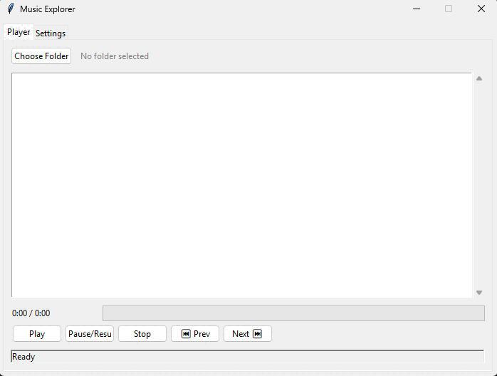
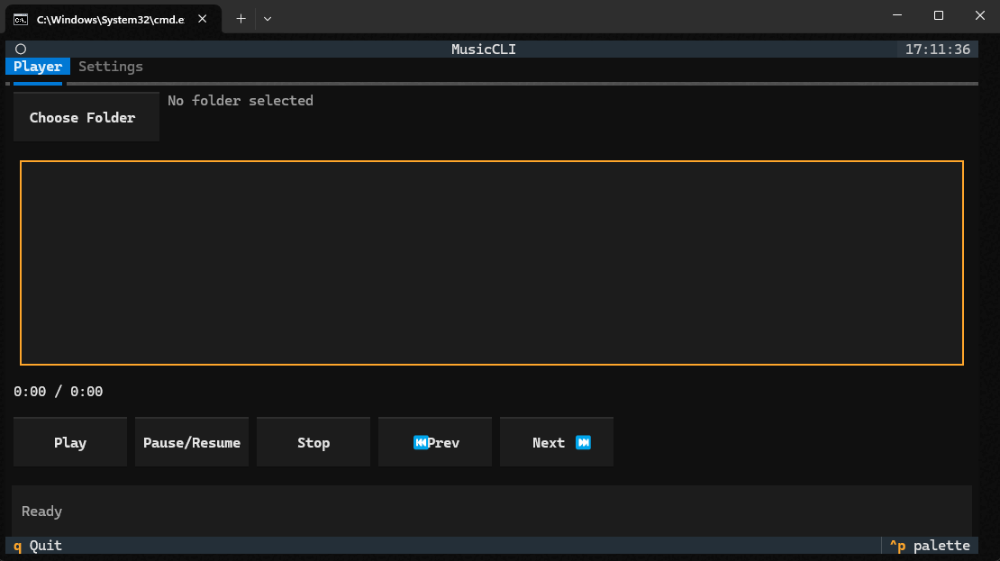

# 🎵 Music Explorer

[](LICENSE)
[](https://www.python.org/)
[](requirements.txt)

A lightweight music player with both a graphical (Tkinter) and terminal (Textual) interface — fast to run, easy to extend.

---

## Table of contents

- [Features](#features)
- [Quick start](#quick-start)
- [Usage](#usage)
- [Installation](#installation)
- [Configuration](#configuration)
- [Screenshots](#screenshots)
- [Contributing](#contributing)
- [License](#license)

---

## Features

- ✅ Dual interfaces: GUI (Tkinter) and TUI (Textual)
- ✅ Supports: MP3, WAV, OGG, FLAC
- ✅ Shuffle and loop modes (Off / All / One)
- ✅ Remembers last folder, last track, and volume
- ✅ Persists playlist order to `queue.json`
- ⚡ Lightweight, minimal dependencies

## Quick start

Recommended: run inside a virtual environment.

```bash
# run with uv (recommended)
uv run main.py

# or run directly with Python
python main.py
```

## Usage

On startup the program offers a choice between GUI and Terminal UI. You can force a mode:

```bash
python main.py -t gui    # GUI only
python main.py -t cli    # Terminal only
```

## Installation

Create a virtual environment and install pinned dependencies:

```bash
python -m venv .venv
.venv\Scripts\activate
pip install -r requirements.txt
```

## Configuration

Settings are saved to `save.json`. Example minimal defaults you can copy into `save.json`:

```json
{
    "current-folder": null,
    "current-file": null,
    "settings": {
        "volume": 100,
        "shuffle": false,
        "loop": "off"
    },
    "queue-file": null
}
```

Playlist order is persisted to `queue.json` inside your music folder.

## Screenshots


*GUI demo*


*Terminal demo*

## Contributing

- Open issues for bugs or ideas
- Send a PR with a clear description and tests where applicable
- Keep changes small and focused

## License

MIT — see the `LICENSE` file.

---

Made with uv, python — happy listening!
